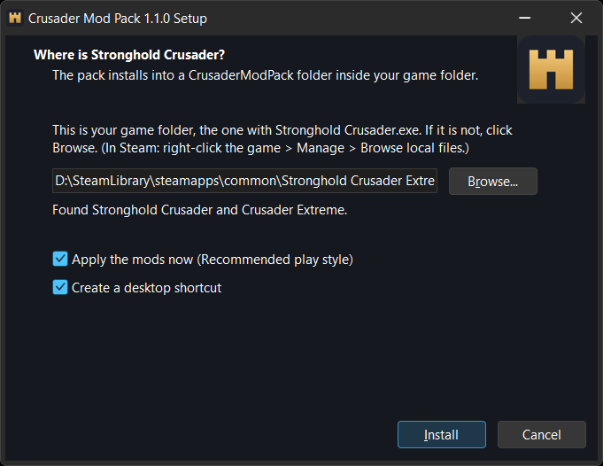
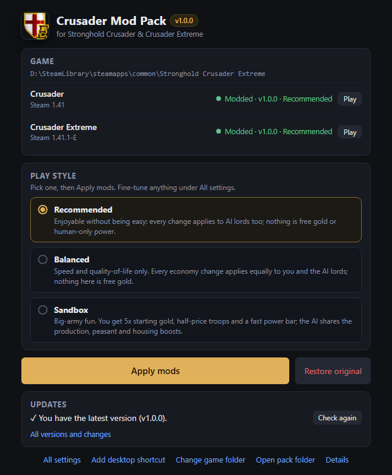

# Crusader Mod Pack

Mods for **Stronghold Crusader** and **Stronghold Crusader Extreme** (Steam, v1.41 / v1.41.1-E):
faster games, a bread economy that's worth building, useful stances, stronger castles, healing,
autosave, your own colour, and a small app that installs, tunes and updates it all.

**[Download the installer](https://github.com/ali-kin4/crusader-mod-pack/releases/latest/download/CrusaderModPack-Setup.exe)**
(`CrusaderModPack-Setup.exe`, 12 MB). Nothing else to install: it brings its own Python.

## Install

1. Run `CrusaderModPack-Setup.exe`. The first time, Windows may say it doesn't know the app:
   click **More info** > **Run anyway**.
2. It finds your game folder by itself (any Steam library, or GOG). If it doesn't, click **Browse**
   and pick the folder with `Stronghold Crusader.exe`.
3. Leave **Apply the mods now** ticked and click **Install**. Done: start the game as usual.

Open **Crusader Mod Pack** from the Start menu or the desktop shortcut to switch play styles,
change any setting, or update:

## Updates

The app checks this page each time it opens. When there's a new version, **Update now**
downloads it, verifies its checksum, installs it, re-applies your mods and keeps your settings.
**Undo the last update** goes back one version. The version list and changes are on the
[releases page](https://github.com/ali-kin4/crusader-mod-pack/releases).

## What's in it

| | |
|---|---|
| **Speed** | Game speed up to 10,000. Numpad `*` toggles turbo, numpad `/` goes back to normal, and a small speed line shows on the map. |
| **Recruiting** | Shift-click recruits 5, Ctrl-click recruits 10, in barracks, the mercenary post and guilds. |
| **Bread** | 12 loaves per flour, every 3rd bread meal is free, and each working bakery adds +1 popularity (up to 3): the wheat, mill and bakery chain finally beats apples. |
| **Stances** | Defensive troops hold an 8-tile zone around their post instead of 5. |
| **Mercenaries** | Recommended style: cheaper and tougher Arab units; slingers and fire throwers reach further. |
| **Castles** | Towers and gatehouses have double hit points, walls take half damage, and towers repair themselves when no enemy is near. |
| **Healing** | Apothecaries slowly heal wounded soldiers standing nearby. |
| **Economy helpers** | Autosave every 5 minutes (3 rotating slots), auto-sell surplus, auto-buy wood and stone; numpad `.` toggles trading. |
| **Your colour** | Play as any of the 8 colours in skirmish, trail and campaign; F9 cycles in game. |
| **More** | AI difficulty slider, bigger Extreme army cap, WASD map scrolling, per-unit hit points, prices and ranges. |

Every change can be switched off or tuned under **All settings** in the app. Most changes apply
to the AI lords too, so the game stays fair.

## Play styles

| Style | For |
|---|---|
| **Recommended** | Enjoyable without being easy. Everything applies to the AI lords too; no free gold. |
| **Balanced** | Closest to the original: speed and quality-of-life, a lighter economy boost. |
| **Sandbox** | Big armies and fast building: 5x starting gold, half-price troops, more production. |

## Remove it

Windows **Settings** > **Apps** > **Installed apps** > **Crusader Mod Pack** > **Uninstall**. It puts
the original game files back and removes the pack. (Steam's **Verify integrity of game files** also
restores the original game.)

Prefer no installer? Each release also has `CrusaderModPack-vX.Y.Z.zip`: extract it into your game
folder, run `Crusader Mod Pack.bat`, and click **Apply mods**. To remove it, click **Restore original**
and delete the `CrusaderModPack` folder.

## Good to know

- **No game files are included.** The pack changes the game exes you already own, keeps a backup
  (`*.exe.orig`), and checks every change against the exe before writing. An unknown exe is refused,
  not damaged.
- **Multiplayer:** everyone needs the same pack version and play style, or the game desyncs.
- **Saves** made above speed 90 crash an unmodded game when loaded.
- **UCP:** don't combine it with the Unofficial Crusader Patch on the same exe; use one or the other.
- **GOG:** the app finds GOG installs too, but the pack is made and tested for the Steam exes.
- **Antivirus / SmartScreen:** new downloads that aren't widely used yet can trigger a warning.
  The installer is made with Inno Setup; the pack is a folder of Python scripts plus python.org's
  official runtime, so you can read every file it installs.
- The app is a small page served only to your own PC (`127.0.0.1`), shown in its own window. It
  closes when you close the window.

## Credits and licences

Made by ali-kin4. Bundled: Python (PSF licence), pefile (MIT), Keystone Engine (GPLv2; its source is
attached to every release). Details are in `THIRD_PARTY_NOTICES.txt` inside the pack.

A fan project, not affiliated with or endorsed by FireFly Studios. Stronghold Crusader is a
trademark of FireFly Studios.
